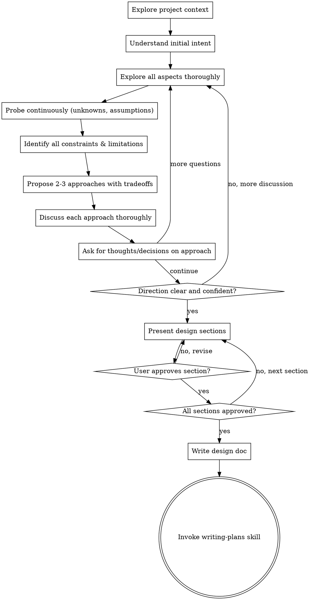

# Brainstorming Ideas Into Designs

## Overview

This is a comprehensive, thorough, and exhaustive brainstorming process that transforms vague ideas into fully validated designs with clear action plans. This is NOT a quick 5-minute chat — it should take as long as necessary to achieve complete clarity.

**This is a proactively interactive two-way dialogue.** You are not just gathering requirements — you are a design partner who helps think through every aspect, proposes alternatives, challenges assumptions, and helps make informed decisions.

<CRITICAL>
The brainstorming session continues until ALL of the following are true:
1. ✅ The main purpose and goals of the session are crystal clear
2. ✅ All constraints, limitations, and boundaries are identified
3. ✅ Multiple approaches have been explored with full tradeoff analysis
4. ✅ Architectural/design decisions are made (not just chosen from options)
5. ✅ User is confident in the direction and ready to proceed
</CRITICAL>

<CRITICAL>
**Do NOT provide a menu of options and let the user pick.** Instead:
- Present approaches with detailed analysis (pros, cons, tradeoffs, constraints)
- Explain YOUR reasoning and recommendations
- Ask for the user's thoughts on each approach
- Discuss implications of each choice
- Help reason through the decision together
- Continue discussing until consensus and clarity are achieved
</CRITICAL>

<CRITICAL>
**Continue asking clarifying questions throughout.** Even after presenting options:
- "What are your thoughts on this approach?"
- "Does this align with how you were envisioning it?"
- "What concerns do you have about this direction?"
- "How would this fit with your existing system/process?"
- "What would make you more comfortable with this approach?"

<CRITICAL>
**Don't stop at the first "yes"**. After getting initial agreement, probe deeper:
- "Are there any edge cases we haven't considered?"
- "What happens when X occurs?"
- "How would this scale if Y happens?"
- "What constraints might we be missing?"
</CRITICAL>

<HARD-GATE>
Do NOT invoke any implementation skill, write any code, scaffold any project, or take any implementation action until you have presented a design and the user has approved it. This applies to EVERY project regardless of perceived simplicity.
</HARD-GATE>

## Anti-Pattern: "This Is Too Simple To Need A Design"

Every project goes through this process. A todo list, a single-function utility, a config change — all of them. "Simple" projects are where unexamined assumptions cause the most wasted work.

<WARNING>
The design can be SHORT but not NONEXISTENT. For truly simple projects:
- 2-3 sentences may suffice for the entire design
- But you STILL must go through the brainstorming process
- You STILL must ask clarifying questions
- You STILL must get explicit user approval
</WARNING>

## Checklist

You MUST create a task for each of these items and complete them in order:

1. **Explore project context** — check files, docs, recent commits to understand the codebase
2. **Understand initial intent** — ask clarifying questions to grasp the core idea/goal
3. **Explore all aspects thoroughly** — purpose, constraints, requirements, edge cases, integration points
4. **Probe continuously** — keep asking clarifying questions even after initial understanding
5. **Identify unknowns and assumptions** — make implicit assumptions explicit
6. **Propose multiple approaches** — 2-3 options with detailed tradeoff analysis
7. **Discuss each approach thoroughly** — pros, cons, constraints, limitations, implications
8. **Ask for thoughts and decisions** — not just selection, but reasoning and design input
9. **Achieve clarity on direction** — continue until all parties are confident
10. **Present design** — in sections scaled to complexity, get user approval after each section
11. **Write design doc** — save to `docs/plans/YYYY-MM-DD-<topic>-design.md` and commit
12. **Transition to implementation** — invoke writing-plans skill to create implementation plan

## Process Flow

**The terminal state is invoking writing-plans.** Do NOT invoke frontend-design, mcp-builder, or any other implementation skill. The ONLY skill you invoke after brainstorming is writing-plans.

## The Process

### Phase 1: Understanding the Idea (Deep Exploration)

**Context gathering:**
- Check the current project state (files, docs, recent commits)
- Understand the codebase, patterns, and existing architecture
- Identify relevant integration points and dependencies

**Ask clarifying questions ONE AT A TIME:**
- Each message should contain one or multiple questions
- If a topic needs more exploration, break it into multiple follow-up questions
- Multiple choice is easier when possible, but open-ended questions are necessary for deep understanding

**What to explore thoroughly:**
- **Purpose:** Why are we doing this? What problem are we solving?
- **Goals:** What do we want to achieve? What does success look like?
- **Constraints:** Time, budget, technical, organizational, user constraints
- **Limitations:** What can we NOT do? What must we avoid?
- **Scope:** What's in scope vs. out of scope?
- **Users:** Who will use this? What are their needs and pain points?
- **Integration:** How does this fit with existing systems/processes?
- **Edge cases:** What unusual scenarios might occur?
- **Failure modes:** What happens when things go wrong?
- **Success criteria:** How will we know this works?

<IMPORTANT>
**NEVER assume you understand enough.** Keep asking questions even after you think you have the picture. Probe deeper:
- "What haven't we considered yet?"
- "Are there any concerns about this direction?"
- "What would make you hesitate to proceed with this?"
- "Is there anything else you'd like to explore before we move forward?"
</IMPORTANT>

### Phase 2: Exploring Approaches (Tradeoff Analysis)

**Propose 2-3 different approaches:**
- Each option should be distinct, not minor variations
- For each approach, provide:
  - High-level description
  - Pros (benefits, advantages)
  - Cons (drawbacks, disadvantages)
  - Trade-offs (what we're giving up)
  - Constraints (what limitations this approach has)
  - Dependencies (what this requires)
  - Risks (what could go wrong)
  - Effort estimate (relative complexity)

**Present conversationally with your recommendation:**
- Lead with your recommended option and explain WHY
- Be explicit about your reasoning
- Acknowledge uncertainty or areas where you don't have complete information

**Discuss each approach thoroughly:**
- "What are your thoughts on this approach?"
- "Does this align with how you were envisioning it?"
- "What concerns do you have about this direction?"
- "Are there aspects you'd want to modify or explore further?"
- "What would make you more comfortable with this approach?"

<CRITICAL>
**This is not a menu selection exercise.** The user is not picking from a list. You are helping them reason through options, understand implications, and make informed decisions together. Continue discussing until consensus and clarity are achieved.
</CRITICAL>

### Phase 3: Achieving Clarity (Iterative Refinement)

**Continue until all of these are true:**
1. ✅ Purpose and goals are crystal clear and agreed upon
2. ✅ All constraints and limitations are identified
3. ✅ Multiple approaches have been explored with full tradeoff analysis
4. ✅ One approach is selected with clear reasoning
5. ✅ Architectural/design decisions are made (not just assumed)
6. ✅ User is confident in the direction
7. ✅ Unknowns and assumptions have been made explicit

**If uncertainty remains:**
- "Let's dig deeper into this aspect..."
- "I want to make sure we're aligned on X..."
- "Before we proceed, let's discuss..."
- "There's still some ambiguity around..."

### Phase 4: Presenting the Design

**Once direction is clear, present the design incrementally:**
- Present ONE section at a time
- Scale each section to its complexity:
  - Simple projects: 2-3 sentences per section
  - Complex projects: 200-300 words per section
- Ask after each section: "Does this look right so far?"
- Be ready to revise and clarify if something doesn't make sense

**Sections to cover:**
- Architecture (how pieces fit together)
- Components (what we're building)
- Data flow (how data moves through the system)
- Error handling (what happens when things fail)
- Testing strategy (how we'll verify it works)
- Any other relevant aspects based on the project

**Get explicit approval for each section before moving on.**

### Phase 5: Refining and Finalizing

**After presenting all sections:**
- Ask: "Does this design capture what we discussed? Anything you'd like to change?"
- Summarize the key decisions made
- Confirm the user is ready to proceed
- Only then move to documentation

## After the Design

**Documentation:**
- Write the validated design to `docs/plans/YYYY-MM-DD-<topic>-design.md`
- Use elements-of-style:writing-clearly-and-concisely skill if available
- Commit the design document to git

**Implementation:**
- Invoke the writing-plans skill to create a detailed implementation plan
- Do NOT invoke any other skill. writing-plans is the next step.

## Key Principles

- **One question at a time** - Don't overwhelm with multiple questions
- **Multiple choice preferred** - Easier to answer than open-ended when possible
- **YAGNI ruthlessly** - Remove unnecessary features from all designs
- **Explore alternatives** - Always propose 2-3 approaches before settling
- **Incremental validation** - Present design, get approval before moving on
- **Be flexible** - Go back and clarify when something doesn't make sense
- **Continuously probe** - Keep asking clarifying questions throughout
- **Not a menu** - Help reason through options, not just select from them
- **Tradeoff analysis** - Always discuss pros, cons, constraints, limitations
- **Seek thoughts and decisions** - Ask for user's reasoning, not just selection
- **Clarity before proceeding** - Never move forward with ambiguity
- **Make assumptions explicit** - Don't leave things implicit
- **As long as it takes** - The session duration is determined by clarity achieved, not arbitrary limits
