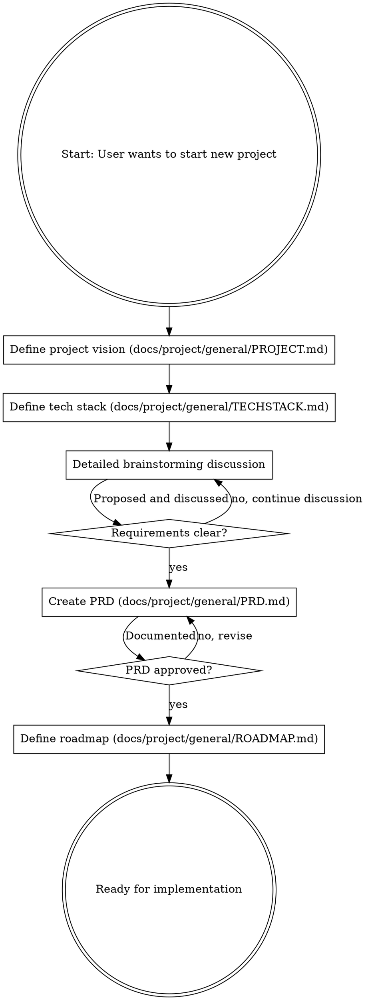

# New Project Initialization

## Overview

Every successful project starts with a clear foundation. This skill guides you through the complete project initialization process, from initial idea to detailed roadmap, ensuring clarity on vision, requirements, scope, and execution plan before any implementation begins.

<HARD-GATE>
Do NOT write any implementation code, scaffold any project structure, or take any implementation action until completing the full initialization process and getting user approval at each major stage.
</HARD-GATE>

## Checklist

You MUST create a task for each of these items and complete them in order:

1. **Define project vision** — create docs/project/general/docs/project/general/PROJECT.md with idea and purpose
2. **Define tech stack** — create docs/project/general/docs/project/general/TECHSTACK.md with technology choices
3. **Brainstorm requirements** — detailed back-and-forth discussion on requirements, scope, and exclusions
4. **Create PRD** — document final requirements in docs/project/general/docs/project/general/PRD.md
5. **Define roadmap** — create docs/project/general/docs/project/general/ROADMAP.md with phases, goals, and tasks

## Process Flow



## The Process

### Stage 1: Project Vision (docs/project/general/PROJECT.md)

**Purpose:** Define the project's core identity before diving into details.

**Content to create:**
- **Project Name:** Clear, descriptive name
- **One-Liner:** Single sentence explaining what the project is
- **Problem Statement:** What problem does this solve?
- **Purpose/Mission:** Why does this project exist? What value does it provide?
- **Target Audience:** Who will use this?
- **Success Criteria:** How do we know if the project is successful?

**Process:**
- Ask the user about their initial idea
- Discuss and refine the purpose together
- Present docs/project/general/PROJECT.md for approval before proceeding

### Stage 2: Tech Stack (docs/project/general/TECHSTACK.md)

**Purpose:** Define the technical foundation and justify choices.

**Content to create:**
- **Frontend:** Frameworks, libraries, styling approach
- **Backend:** Runtime, frameworks, API design
- **Database:** Data storage choices and reasoning
- **Infrastructure:** Hosting, deployment, CI/CD
- **Development Tools:** Testing, linting, build tools
- **Rationale:** Why each choice was made (trade-offs considered)

**Process:**
- Discuss project requirements and constraints
- Suggest appropriate technologies with alternatives
- Present options with trade-offs
- Document final choices in docs/project/general/TECHSTACK.md with justifications

### Stage 3: Requirements Brainstorming

**Purpose:** Achieve complete clarity on WHAT to build before planning HOW.

This is the CRITICAL phase. The discussion should be as long as needed to achieve clarity.

**Key aspects to explore:**

**Functional Requirements:**
- What features MUST be included?
- What features SHOULD be included if time permits?
- What user flows need to be supported?

**Non-Functional Requirements:**
- Performance expectations
- Security requirements
- Scalability needs
- Accessibility standards
- Cross-platform requirements

**Scope Boundaries:**
- What is explicitly IN SCOPE?
- What is explicitly OUT OF SCOPE?
- What are "maybe later" items to defer?

**Technical Decisions:**
- Architecture patterns
- Data models (high-level)
- API contracts (if applicable)
- Integration points (third-party services, etc.)

**Process:**
- Ask clarifying questions proactively
- Provide suggestions and alternatives
- Discuss trade-offs openly
- Ask for user's thoughts on decisions
- Continue until requirements are crystal clear
- Present summary for confirmation before creating PRD

### Stage 4: Product Requirements Document (docs/project/general/PRD.md)

**Purpose:** Create the definitive reference for WHAT is being built.

**Content structure:**

```markdown
# Product Requirements Document: [Project Name]

## Overview
[Brief description of the project]

## Objectives
[Primary goals and success metrics]

## Target Users
[User personas and needs]

## Functional Requirements
### Must Have (P0)
- [Critical features]
- [Core functionality]

### Should Have (P1)
- [Important features]
- [Enhanced functionality]

### Nice to Have (P2)
- [Future enhancements]
- [Polish features]

## Non-Functional Requirements
- Performance: [specific requirements]
- Security: [security considerations]
- Scalability: [scaling expectations]
- Accessibility: [a11y standards]

## User Stories
[As a [user type], I want [action] so that [benefit]]

## Scope Boundaries
### In Scope
[What we're building]

### Out of Scope
[What we're explicitly not building]

## Technical Considerations
[Architecture notes, data models, API contracts]

## Success Metrics
[How we'll measure success]
```

**Process:**
- Compile all agreed-upon requirements
- Structure into clear PRD format
- Present for review and approval
- Revise as needed until user approves

### Stage 5: Roadmap (docs/project/general/ROADMAP.md)

**Purpose:** Break the project into manageable phases with clear goals and tasks.

**Content structure:**

```markdown
# Roadmap: [Project Name]

## Phase 1: [Phase Name]
**Description:** [Brief description of phase purpose]
**Main Goal:** [The primary objective of this phase]
**Estimated Duration:** [Time estimate]

### Tasks
- [ ] [Specific task 1]
- [ ] [Specific task 2]
- [ ] [Specific task 3]

**Dependencies:** [What needs to be completed first]
**Deliverables:** [What will be completed by end of phase]

## Phase 2: [Phase Name]
[Same structure as Phase 1]

[Continue for all phases...]

## Future Considerations
[Items noted for later phases or future versions]
```

**Phase planning principles:**
- Each phase should have a clear, achievable goal
- Phases should build on each other logically
- Early phases should deliver value quickly
- Identify dependencies between phases
- Consider risk and complexity when ordering

**Process:**
- Break down requirements into logical phases
- Define clear goals and tasks for each phase
- Present roadmap for discussion
- Refine based on feedback until approved

## Anti-Patterns to Avoid

**"We can figure it out as we go"** - Unclear requirements lead to wasted work and rewrites

**"Let's just start coding"** - Implementation without clear requirements always leads to problems

**"The requirements are obvious"** - Requirements are NEVER as obvious as they seem. Write them down.

**"This project is too simple for a roadmap"** - Even simple projects benefit from phased planning. Keep phases simple if the project is simple.

**"Let's add everything at once"** - Prioritize ruthlessly. Not everything needs to be in Phase 1.

## Key Principles

- **Clarity over speed** - Take time to get it right. It's faster than re-doing it.
- **Proactive discussion** - Suggest ideas, raise concerns, offer alternatives
- **User-driven decisions** - The user decides. You advise and recommend.
- **Document everything** - If it's not written down, it doesn't exist.
- **Phase for value** - Each phase should deliver tangible value.
- **Ruthless prioritization** - Not everything can be P0. Make hard choices.

## Completion Criteria

The initialization is complete when:
1. ✅ docs/project/general/PROJECT.md defines clear vision and purpose
2. ✅ docs/project/general/TECHSTACK.md documents all technology choices with rationale
3. ✅ docs/project/general/PRD.md contains detailed, approved requirements with clear scope boundaries
4. ✅ docs/project/general/ROADMAP.md breaks the project into phases with goals and tasks
5. ✅ User has approved each major deliverable
6. ✅ Team has shared understanding of what will be built

## After Initialization

Once initialization is complete:
- All foundational documents are in place
- The project is ready for implementation planning
- Use brainstorming skill for feature-level design
- Use writing-plans skill for implementation planning
- Proceed with confidence and clarity

---

**Remember:** This skill is STANDALONE. It does not require or depend on any other skill. It provides complete guidance from initial idea to actionable roadmap. Use it at the start of every new project.